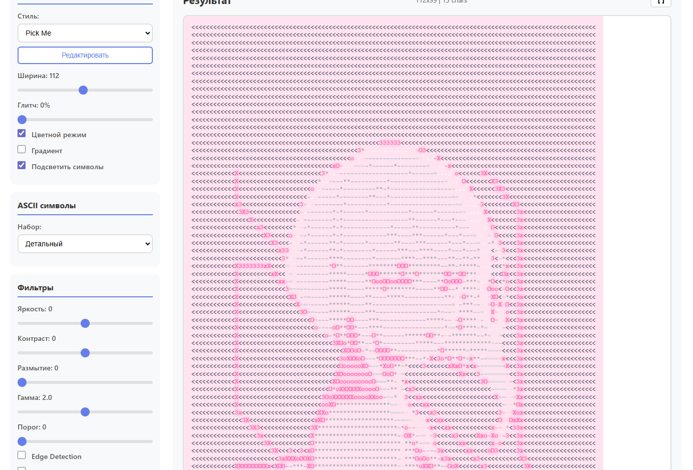

# ASCII Converter

Convert images to ASCII art directly in the browser.

## Features

- Drag & drop or file selection for image upload
- 3 built-in styles with unique character sets
- Custom styles saved to localStorage
- Filters: brightness, contrast, blur, gamma, threshold, edge detection, dithering, invert
- 4 border types: solid, double, dashed, rounded
- Color mode and gradient (color based on pixel brightness)
- Style symbol highlighting
- Fullscreen mode
- Export to TXT and HTML

## Styles

**Classic** — standard character set `@%#*+=-:. `, no glitch

**Pick Me** — characters `♡ < 3 x X o O * ~ = - .`, pink background, glitch `<3`, `xo`, `♡`

**Dead Inside** — characters `Z X x c 7 1 0 0 0 - _ + = : .`, black background, glitch `zx`, `xc`, `7`

## Filters

| Filter | Description |
|--------|------------|
| Brightness | -100 to +100 |
| Contrast | -100 to +100 |
| Blur | 0 to 10px |
| Gamma | 0.1 to 3.0 |
| Threshold | Binarization 0-255 |
| Edge Detection | Sobel operator |
| Dithering | Floyd-Steinberg |
| Invert | Inverts colors |

